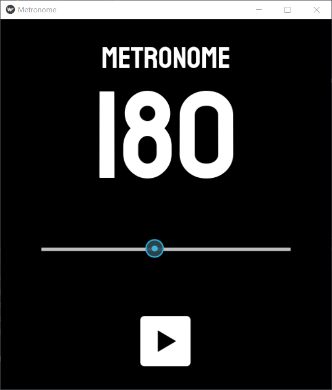

# Kivy Metronome
A simple metronome created with Python and Kivy. 
It has tempos ranging from 130 up to 240 (with an increment of 5). 

Due to the limitations of Kivy's clock function, I decided to generate rhythm tracks for each tempo.  Otherwise, using *Clock.schedule_interval* (or *clock.sleep*), we won't be able to achieve ideal tempo track. 

